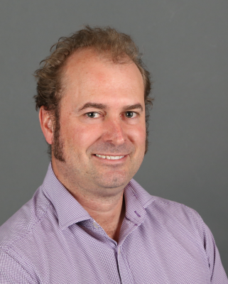

## Associate Professor, Climate Change and Health at Curtin University

  

I am recognised as one of Australia’s leading Environmental Epidemiologists. My current role is Teaching (40%), Research (40%) and Service (20%). I use my extensive experience across a wide range of environmental health issues to focus on Climate Change and Health, and pursue the Sustainable Development Goals.

I am Director of the Curtin WHO Collaborating Centre for Climate Change and Health Impact Assessment and Senior Lecturer in Climate Change and Health at the School of Population Health, Faculty of Health Science at Curtin University. I collaborate with a wide range of experts on Australian and international projects including as Chief Investigator of HEAL (Healthy Environments And Lives) Australian National Research Network where I am co-lead of the Data and Decision Support Theme, the Climate change adaptation to Smoke Haze for Improved Child Health in Southeast Asia project (NHMRC e-Asia award), Mortality Burden due to Forest Fire Smoke in Malaysia and Implications for Climate Change Planning research (Centre for Safe Air NHMRC CRE) and the Lancet Oceania Countdown on Climate Change and Health. My personal details are:
- Email: ivan.hanigan@curtin.edu.au
- ORCID: [http://orcid.org/0000-0002-6360-6793](http://orcid.org/0000-0002-6360-6793)
- Scopus: [https://www.scopus.com/authid/detail.uri?authorId=21934126200](https://www.scopus.com/authid/detail.uri?authorId=21934126200)
- Google Scholar: [https://scholar.google.com/citations?user=cGN1P0wAAAAJ&hl=en](https://scholar.google.com/citations?user=cGN1P0wAAAAJ&hl=en)

