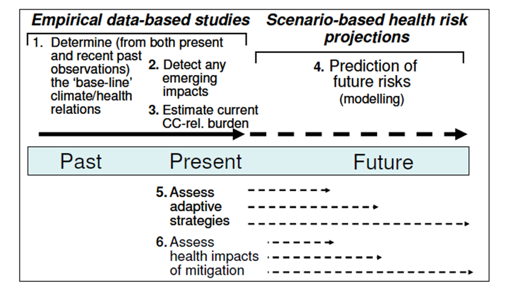

<h2 class="widget-title">Entries by Tags</h2>

Jump to [Latest Posts](#latest-posts)

The image below shows how my research outputs have been tagged using a comprehensive framework for Climate Change and Health Impact Assessment. I also tag each research output using the type of environmental risk factor (e.g. drought, bushfires, heat etc).

Source: McMichael, A., Berry, H., Butler, C., Capon, A., Dear, K., **Hanigan, I.C.**, Lucas, R. & Strazdins, L. (2008). Assessing the scale and nature of health vulnerability to climate change. Technical report for WHO global consultation on ‘Guiding research to improve health protection from climate change’. World Health Organisation, Geneva. (D. Campbell-Lendrum & R. Bertollini, Eds.).

<ul>
<!-- my first attempt -->
<!--
<li><a href="/Ivan-Hanigan-CV/tag/{{tag | first}}">{{tag | first}} ({{tag | last | size }})</a></li>


</ul>
-->
<!-- Kudos to https://stackoverflow.com/a/54637489 -->
<!-- // create empty array -->


<!-- // iterate through tags, get tag name and make into an array, concat arrays -->

    
    


<!-- // sort tags -->

    
<!-- // create list of tags and number of posts with that tag -->
<section>
    <ul>
        
            
            <li>
<!--                <a href="#{{ tag | cgi_escape }}" class="tag">
                    {{ tag }}
                    ({{ postCount }})
                </a> -->
                <a href="/Ivan-Hanigan-CV-dark/tag/{{ tag }}">{{ tag }} ({{ postCount }})</a>
            </li>
        
    </ul>
 </section> 

<h1> Latest Posts</h1>

<ul>
  
    <li>
      <!-- <h2><a href="https://ivanhanigan.github.io/Ivan-Hanigan-CV-dark{{ post.url }}">{{  post.title }}</a></h2> -->
      <h2><a href="/Ivan-Hanigan-CV-dark{{ post.url }}">{{ post.date | date_to_string }}: {{  post.title }}</a></h2> 
      {{ post.excerpt }} 
      <a href="/Ivan-Hanigan-CV-dark{{ post.url }}">Read more</a>
      

      tags: <a href="/Ivan-Hanigan-CV-dark/tag/{{ post.tags | first }}">{{ post.tags | first }}</a>
      <a href="/Ivan-Hanigan-CV-dark/tag/{{ post.tags | last }}">{{ post.tags | last }}</a>

<!--      tag: <a href="/Ivan-Hanigan-CV-dark/tag/{{ post.tags }}">{{ post.tags }}</a> -->

    </li>
  
  

</ul>

